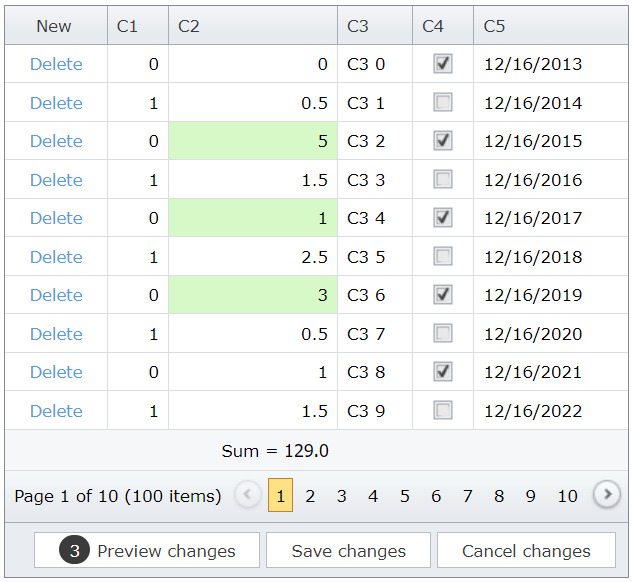

# Grid View for ASP.NET Web Forms - How to update total summaries on the client in batch edit mode
<!-- run online -->
**[[Run Online]](https://codecentral.devexpress.com/128536038/)**
<!-- run online end -->

This example demonstrates how to create a templated column that displays the total summary in the footer. The summary is calculated dynamically in batch edit mode. In this example, the grid's [HighlightDeletedRows](https://docs.devexpress.com/AspNet/DevExpress.Web.GridViewBatchEditSettings.HighlightDeletedRows) property is set to `false`.



## Overview

1. Specify a column's [FooterTemplate](https://docs.devexpress.com/AspNet/DevExpress.Web.GridViewColumn.FooterTemplate) property and add a label to the template to display the result of total summary calculation.

    ```aspx
    <dx:GridViewDataSpinEditColumn Width="100" FieldName="C2">
        <FooterTemplate>
            Sum =
            <dx:ASPxLabel ID="ASPxLabel1" runat="server" ClientInstanceName="labelSum"
                Text='<%# GetTotalSummaryValue() %>' />
        </FooterTemplate>
    </dx:GridViewDataSpinEditColumn>
    ```

2. Add a total summary item for the corresponding column. Use the item's [Tag](https://docs.devexpress.com/AspNet/DevExpress.Web.ASPxSummaryItemBase.Tag) property to identify the summary item and get its value.

    ```aspx
    <TotalSummary>
        <dx:ASPxSummaryItem SummaryType="Sum" FieldName="C2" Tag="C2_Sum" />
    </TotalSummary>
    ```

    ```cs
    protected object GetTotalSummaryValue() {
        ASPxSummaryItem summaryItem = Grid.TotalSummary.First(i => i.Tag == "C2_Sum");
        return Grid.GetTotalSummaryValue(summaryItem);
    }
    ```

3. Handle the grid's client-side [BatchEditEndEditing](https://docs.devexpress.com/AspNet/js-ASPxClientGridView.BatchEditEndEditing) and [BatchEditRowDeleting](https://docs.devexpress.com/AspNet/js-ASPxClientGridView.BatchEditRowDeleting) events. In handlers, use the grid's [batchEditApi.GetCellValue](https://docs.devexpress.com/AspNet/js-ASPxClientGridViewBatchEditApi.GetCellValue(visibleIndex-columnFieldNameOrId)) method to get initial cell values and `rowValues` argument property to get new cell values. Then recalculate the summary value and assign it to the label.

    ```js
    function OnBatchEditEndEditing(s, e) {
        CalculateSummary(s, e.rowValues, e.visibleIndex, false);
    }
    var savedValue;
    function CalculateSummary(grid, rowValues, visibleIndex, isDeleting) {
        var originalValue = grid.batchEditApi.GetCellValue(visibleIndex, "C2");
        var newValue = rowValues[(grid.GetColumnByField("C2").index)].value;
        var dif = isDeleting ? -newValue : newValue - originalValue;
        var sum = (parseFloat(labelSum.GetValue()) + dif).toFixed(1);
        savedValue = sum;
        labelSum.SetValue(sum);
    }
    function OnBatchEditRowDeleting(s, e) {
        CalculateSummary(s, e.rowValues, e.visibleIndex, true);
    }
    ```

## Files to Review

* [Default.aspx](./CS/Default.aspx) (VB: [Default.aspx](./VB/Default.aspx))
* [Default.aspx.cs](./CS/Default.aspx.cs) (VB: [Default.aspx](./VB/Default.aspx))

## Documentation

* [Grid in Batch Edit Mode](https://docs.devexpress.com/AspNet/16443/components/grid-view/concepts/edit-data/batch-edit-mode)

## More Examples

* [Grid View for ASP.NET MVC - How to update total summaries on the client in batch edit mode](https://github.com/DevExpress-Examples/gridview-how-to-update-total-summaries-on-the-client-side-in-batch-edit-mode-t137186)
* [Grid View for ASP.NET Web Forms - How to calculate values dynamically in batch edit mode](https://github.com/DevExpress-Examples/asp-net-web-forms-gridview-calculate-values-dynamically-batch-mode)
* [Grid View for ASP.NET Web Forms - How to calculate values and total summaries dynamically in batch edit mode](https://github.com/DevExpress-Examples/aspxgridview-batch-edit-how-to-calculate-unbound-column-and-total-summary-values-on-the-fly-t116925)
* [Grid View for ASP.NET Web Forms - How to update total summaries in batch edit mode when deleted rows are highlighted](https://github.com/DevExpress-Examples/aspxgridview-batch-editing-how-to-update-summaries-when-highlightdeletedrowstrue-t517531)
